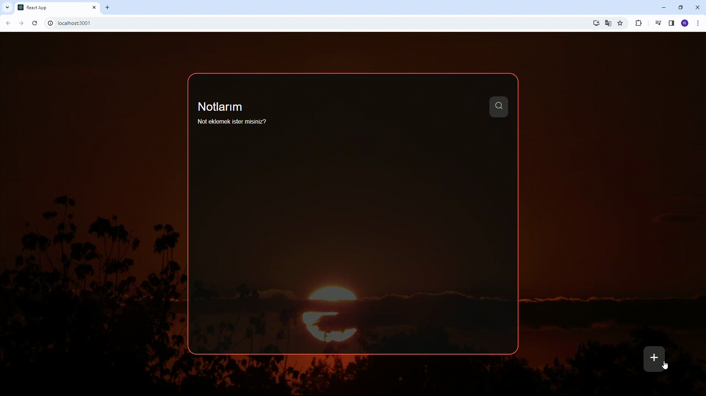

<h1>Note-App-Project</h1>

Özellikler

1. Notları Görüntüleme

Ana sayfada kullanıcılar, oluşturdukları notları başlık ve tarih bilgisiyle birlikte görebilirler.

2. Not Arama

Kullanıcılar, notları aramak için arama kutusunu kullanabilirler. Arama sonuçları, not başlıklarındaki eşleşmeleri içerir.

3. Yeni Not Ekleme

"Yeni Not Ekle" butonuna tıklanarak kullanıcılar yeni bir not oluşturabilirler. 

4. Not Düzenleme

Notların detaylarını düzenlemek için "Düzenle" butonu kullanılabilir. Bu, notun başlığını, detaylarını ve tarihini güncellemek için bir düzenleme sayfasına yönlendirir.

5. Not Silme

Herhangi bir notu silmek için, "Düzenle" sayfasında bulunan "Sil" butonu kullanılabilir. Silme işlemi onaylanmalıdır.

